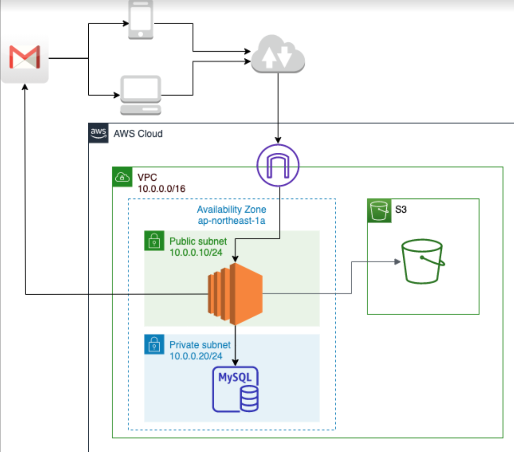
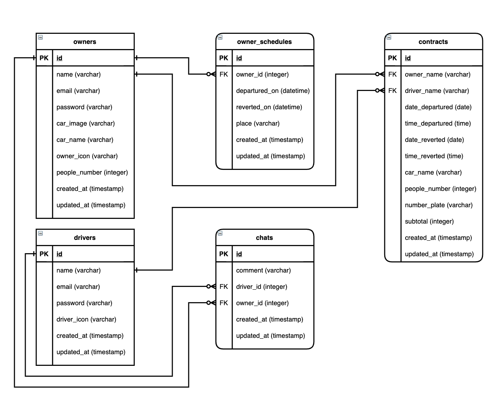

 

# 概要
&emsp; 車両を保有している人と保有していない人を結ぶSNSアプリケーション。
大手カーシェアリングサービスのように車両を会社からドライバーに貸し出す(BtoB)のでなく、
**個人間で気軽に貸し借りができるサービス(CtoC)をコンセプト**とした。 
[→[アプリケーション リンク](http://aws-tatsuya-infra)]

# 制作背景
&emsp; 交通インフラの整備や若者の車離れの影響を受け、自動車の国内需要は１９９０年ごろをピークとして年々減少している。これに伴い、大手のBtoBカーシェアリングサービス(タイムズ)の会員数は過去5年間で約4倍以上伸びている。対して、**今後伸びてくると予想されていたCtoCのカーシェアリング業界は伸び悩んでいる**というギャップが生じている。この現象に疑問を持ったため、原因をトヨタの問題解決の手法を用いて考え、このギャップを解決するサービスの開発を行った。
 [→[制作背景詳細 リンク](https://docs.google.com/presentation/d/1tZJGasBnQbUNXXe0prZ4kC7agbCEJ5aUzGzq7WhR7zA/edit?usp=sharing)]

# 操作説明
このサービスのユーザーは3パターンに分けられる。 
&emsp; A.ドライバー (車を借りたい人） 
&emsp; B.オーナー （車を貸したい人） 
&emsp; C.管理者 (Car.マッチング株式会社:自動車保険会社） 
それぞれの操作について下記に示す。
[→[操作詳細説明 リンク](https://docs.google.com/presentation/d/1vp0uW4S5cwLc9BGpcaWo-VbV1Sns1QpCnw0aN3KeQYs/edit?usp=sharing)]

## A. ドライバーの基本操作 &emsp; (車を借りたい人） 
 

ログイン→希望の条件で検索→該当したオーナーとチャットでの交流

## B. オーナー（車を貸したい人）の基本操作① 
 

ログイン → 車両を貸し出せる日程を登録 → ドライバーから依頼があればチャットでの交流 → オーナーとドライバーが契約条件に合意した場合、契約フォームに記入し、Car.マッチングへメール送信

## B. オーナー（車を貸したい人）の基本操作② 

## C. 管理者(Car.マッチング株式会社:自動車保険会社）の基本操作 

 
# こだわり

私はCtoCのカーシェアリング業界が伸びていない原因は主に下記の3点に起因すると考える。 
&emsp; ①初期登録操作のハードルが高い 
&emsp; ②条件に合う車両を探す作業が煩わしい 
&emsp; ③全く交流がない他人から車両を借りることへの不安がある 

これらを解決するために下記にこだわって開発した。

**A. 初期登録の簡略化** 
&emsp; 初期の登録はなるべくシンプルにしておき、ドライバーとオーナーの交渉が成立してから、更に必要な情報を入力させる。ナンバープレート情報や料金の設定など初期登録の際に煩わしさを感じるものは最後に入力する。
    
**B. 操作がシンプル** 
&emsp; ドライバーの操作： 初期登録 → 検索 → チャットによるオーナーとの交渉 
&emsp; オーナーの操作 ： 初期登録→ 貸出日程登録 → チャット → 契約詳細入力 
&emsp; として、各ページに余計な機能は付けず、直感的に分かりやすい構成を心がける。
    
**C. LINEのような手軽さで個人間でチャットが可能(非同期通信)** 
&emsp; アプリ内のチャット機能を、スマートフォンユーザーのおよそ80％が利用しているLINEの操作に合わせることで、誰でも容易にチャット機能を使って交流できる。また、非同期通信を行うことによって画面の遷移無しで、相手のメッセージを受け取ることができる。
    
上記とは色合いが異なるが、その他にもユーザーと管理者を思いやった機能も追加した。    

**D. 契約内容のエビデンスとしてメールの自動送信** 
&emsp; オーナーが契約内容を入力後、確認メールが自動でドライバー・オーナー・Carマッチング（自動車保険会社）へと送付される。これにより、ドライバーとオーナーとの間で契約した内容を失念しても、再度確認することができる。また、料金や内容の相違でトラブルが起きた際に、エビデンスとして示すこともできる。

**E. 管理者用の契約内容閲覧機能** 
&emsp; ドライバーとオーナー間で契約が結ばれた後、DBへその内容が保存されるため、その内容を表示する機能。その内容を見て自動車の保険の加入手続・料金の支払い手続きに移行する。
[[→要件定義書 リンク](https://docs.google.com/presentation/d/1vWEF7MWPqWR6HSBz8aYNJNr0i8-kscc3NNe2huMJbcU/edit?usp=sharing)] 
# 使用技術
 
**バックエンド** 
&emsp; PHP 7.2.34 / Laravel 6.20.5

**フロントエンド** 
&emsp; HTML / CSS / javascript / jQuery 3.2.1 / Vue.js(現在学習中のため今後組み込む)

**インフラ** 
&emsp; mysql 8.0.22 / AWS(EC2,S3)

**その他の使用技術** 
&emsp; Pusher / git(gitHub) / Visual Studio Code / draw.io / Gmail
 
# AWS構成図

# DB設計
### ER図

### 各種テーブル

| **テーブル名** | **定義** |
| ---- | ---- |
| owners(オーナー) | オーナーの登録情報 |
| drivers(ドライバー) | ドライバーの登録情報 |
| owner_schedules(オーナースケジュール) | ドライバーの車両貸出可能な日程 |
| chats(チャット) | 会話の内容 |
| contracts(コントラクト) | 契約確定後、契約内容を格納|

# 使い方

ーオーナ（貸したい人）ー

ーオーナ（貸りたい人）ー
DEMOの実行方法など、"hoge"の基本的な使い方を説明する
 

# 苦労したところ

### ①DB設計

&emsp; ER図を添付していますが、実際のアプリケーションとテーブル名やカラム名に相違があります。テーブルの命名規則の理解が曖昧ままDB設計をしており、キャメルケースを用いた記述をしてしまいました。開発終盤に気付きましたが、影響範囲が広すぎて修正が困難になりました。この失敗を二度と繰り返さないよう再度学習を行い、Qiitaにまとめています。初期設計の重要性を身に染みて学びました。[→[Qiita記事 リンク](https://qiita.com/tatsuya_1995/items/4b706fc40fe2f300bbc0)]

### ②AWSでのデプロイ
&emsp; web系企業ではクラウドはAWSが主流になっていますのでAWSを用いて本番環境を構築しました。初めてのVimコマンドの操作に慣れていないことや、ディレクトリの階層も頭に入っていなかったことで、configファイルや.envファイルを探したり編集するだけでかなり難航しました。VPCの生成から数えると30〜40時間以上かけてなんとかデプロイしました。多く悩んだ分、仮想サーバーやIPアドレスの考え方・コマンドの操作などを身に着けることができました。

# 最後に
大変お忙しい中、最後までご覧いただき誠にありがとうございました。 
ご興味を持っていただけましたら、下記もご覧頂けると幸いです。 
[[自己紹介サイト](https://tatsudesign.net/portfolio/main/index.html):学歴・職務経歴・webエンジニアを目指す経緯などを記載しています！] 
[[Qiita](https://qiita.com/tatsuya_1995):発信力を持ったエンジニアになるべく今後はドシドシ投稿していきます！] 
[[Twitter](https://twitter.com/string_tatsuya):日々の学習を記録・発信しています！] 

